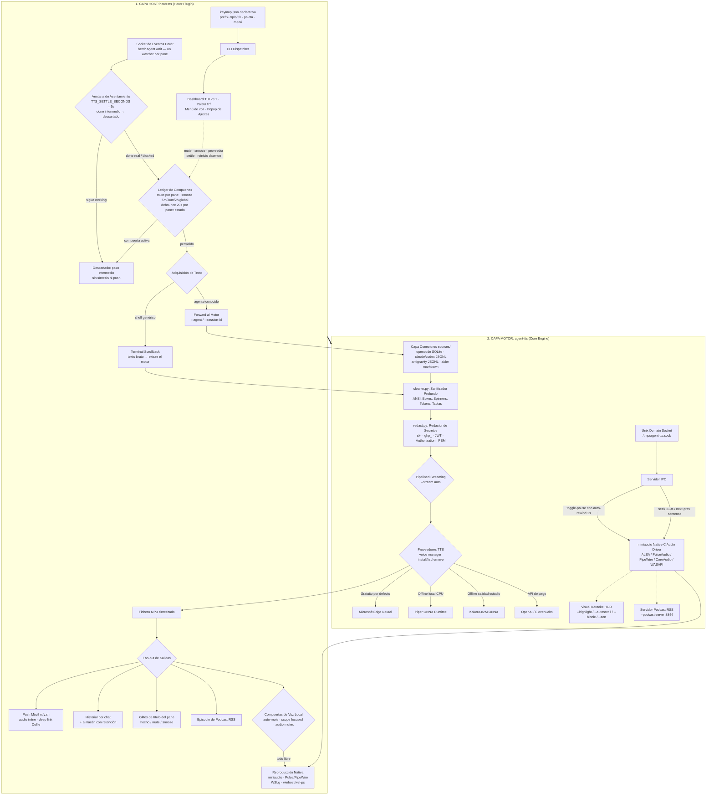

# Arquitectura del Sistema: `herdr-tts` & `agent-tts`

> **Documento de Diseño y Arquitectura de la Suite de Audio para Agentes**  
> Proyecto: [`chiptime/herdr-tts`](https://github.com/chiptime/herdr-tts) y [`chiptime/agent-tts`](https://github.com/chiptime/agent-tts)

---

## 1. Visión y Motivación

Cuando se orquestan múltiples coding agents simultáneamente en terminal (mediante [Herdr](https://herdr.dev), OpenCode, Claude Code, etc.), surgen tres problemas operativos críticos:

1. **Cacofonía acústica por colisión de voces:** Si tres agentes en paralelo completan tareas casi a la vez, los sistemas convencionales reproducen audio de forma superpuesta, generando un muro ininteligible de ruido.
2. **Interrupción y fatiga de contexto:** Si un desarrollador está redactando un prompt complejo en una ventana activa, no debe ser interrumpido por la lectura prolija de un agente que concluyó en segundo plano.
3. **El texto de terminal no es prosa hablada:** Los buffers de consola están saturados de secuencias de escape ANSI, bordes Unicode de cajas (`│`, `┌`, `└`), barras de progreso, contadores de tokens (`14.2k in | 520 out`) y bloques de código que resultan confusos al leerse textualmente.

Para resolver esto, la suite se estructura en dos capas independientes y complementarias:

---

## 2. Arquitectura en Dos Niveles (Decoupled Architecture)

### Nivel 1: `herdr-tts` (Thin Connector Host Layer)
- **Responsabilidad:** Integración con el multiplexor Herdr, gestión de concurrencia y ciclo de vida de agentes. El host **no sabe leer agentes**: detecta que algo pasó y delega.
- **Audio Mutex Lock:** Cerrojo en `/tmp/herdr-tts-playing.lock` que serializa los eventos concurrentes (encola o descarta) **sin interrumpir jamás la reproducción en curso**. Vive en el host porque aquí nace la concurrencia (múltiples panes lanzando eventos); el motor es *connection-scoped*: atiende la conexión que entra sin conocer cuántas existen ni su tipología.
- **Filtrado por Foco (`scope: focused`):** Solo vocaliza automáticamente el pane que el usuario está observando activamente.
- **Delegación de Extracción (Agent Forwarding):** Para agentes conocidos, el host solo identifica `agent_kind` + `session_id` y delega la lectura al motor (`--agent` / `--session-id`). Para shells genéricas, captura el scrollback y lo entrega en bruto: el motor extrae el último turno. El flag `--pre-extracted` existe para hosts que ya conocen el mensaje exacto (p. ej. herdr-brain vía eventos) y no lo usa este host.
- **Notificaciones Push Móviles:** Envío del fichero de audio sintetizado a la app `ntfy.sh` en Android/iOS con reproductor en pantalla de bloqueo y deep links a la interfaz web (Collie).

### Nivel 2: `agent-tts` (Standalone Speech Engine)
- **Responsabilidad:** Motor de síntesis, audio nativo y sanitización de texto para terminales. El motor **no conoce el concepto de pane**: posee el conocimiento de fuente de cada agente.
- **Capa de Conectores de Agentes (`sources/`):** `opencode.py` (SQLite en modo solo lectura) y `claude.py` (JSONL de sesión con tail-scan inverso) resuelven la transcripción a partir de `{agent_kind, session_id}`; nuevos conectores (aider, gemini-cli, goose) se añaden aquí sin tocar el host.
- **Driver Nativo en C (`miniaudio`):** Reproduce audio directamente en memoria hacia PulseAudio/PipeWire (Linux), CoreAudio (macOS) y WASAPI (Windows) con latencia mínima, sin procesos externos (`mpv`, `paplay`).
- **Servidor IPC Interactivo:** Expone un socket Unix (`/tmp/agent-tts.sock`) para responder en caliente a comandos como `toggle-pause`, `seek +10`, `seek -10`, `next-sentence` y `prev-sentence`.
- **Auto-Rewind Cognitivo:** Al reanudar una reproducción en pausa, retrocede automáticamente 2.0 segundos para recuperar el hilo mental de la explicación.
- **Sanitizador Profundo (`cleaner.py`):** Elimina códigos ANSI, spinners, bordes de cajas y contadores de tokens; convierte tablas Markdown/ASCII en pausas conversacionales.
- **Pipelined Streaming:** Reproduce la primera frase en ~300–600ms mientras continúa sintetizando el resto del texto en un hilo de fondo.
- **Transporte de Audio a Windows (`winhost` / `wsl-ps`):** En WSL2 el motor puede enviar el PCM por TCP al host Windows (`agent-tts --winhost`, reproducción nativa vía WASAPI) con fallback automático a PowerShell en modo cero instalación; el host solo propaga la opción (`TTS_PLAYBACK`), sin cambios en su flujo por defecto.

---

## 3. Protocolo de Control IPC y Atajos

| Acción | Atajo Herdr | Comando CLI | Comando IPC (Socket) |
| :--- | :---: | :--- | :--- |
| **Play / Stop (Toggle)** | `prefix + r` | `herdr-tts --toggle-play` | N/A (Gestionado por Host) |
| **Pausa / Reanudar** | `prefix + p` | `herdr-tts --toggle-pause` | `toggle-pause` (con auto-rewind 2s) |
| **Parada Inmediata** | `prefix + s` | `herdr-tts --stop` | `stop` |
| **Rebobinar 10 segundos** | `prefix + [` | `herdr-tts --rewind` | `seek -10` |
| **Avanzar 10 segundos** | `prefix + ]` | `herdr-tts --forward` | `seek +10` |
| **Siguiente Frase** | `prefix + n` | `herdr-tts --next-sentence` | `next-sentence` |
| **Frase Anterior** | `prefix + N` | `herdr-tts --prev-sentence` | `prev-sentence` |
| **Resumen TL;DR** | `prefix + t` | `herdr-tts --tldr` | `--tldr` (heurística offline) |
| **Silenciar Auto-Speech**| `prefix + v` | `herdr-tts --toggle-auto` | N/A (Gestionado por Host) |
| **Velocidad (+10% / -10%)**| `prefix + =` / `-` | `herdr-tts --rate-up` / `down` | N/A (Persistido en config) |

---

## 4. Proveedores de Síntesis Soportados

1. **Microsoft Edge Neural (Default — 100% Free):** Voces naturales fluidas (`elvira`, `alvaro`, `en`) con latencia reducida y cero configuración de claves API.
2. **Piper ONNX (100% Offline — CPU):** Síntesis neuronal local ejecutada íntegramente en CPU mediante ONNX Runtime para entornos sin conexión o de alta privacidad.
3. **OpenAI Audio TTS:** Modelos `tts-1` y `tts-1-hd` (`nova`, `alloy`, `onyx`) para máxima fidelidad de estudio, con streaming pipelined por HTTP chunked.
4. **ElevenLabs:** Voces ultra-realistas multilingües (`eleven_multilingual_v2`), con streaming pipelined por HTTP chunked.
5. **Kokoro-82M ONNX (100% Offline — CPU):** Motor neural local de última generación (~325 MB), calidad de estudio sin cloud ni API keys (`agent-tts voice install kokoro`).

---

## 5. Estado de Implementación y Roadmap

### Estado Actual (Septiembre 2026)

Todas las funcionalidades planificadas se desarrollan bajo el principio de **implementación limpia e independiente (Clean-Room)**: se extrae la necesidad funcional detectada en el flujo de trabajo multi-agente, diseñando arquitectura propia sin reutilizar código de proyectos de terceros.

#### ✅ `herdr-tts` (Host Layer) — Completado
- **Snooze Granular & Mute por Pane**: Ciclos `prefix+z` (5m/30m/2h/off), mute por pane `prefix+m` con auto-clear al cerrar pane, snooze global `prefix+Z`. Estado persistido en ficheros de timestamp.
- **Anti-Spam Debouncing**: Ventana `TTS_DEBOUNCE_SECONDS` (default 20s) que suprime re-disparos del mismo `pane_id`+`status` sin bloquear la ejecución principal.
- **Ventana de Asentamiento (Settle Window)**: `TTS_SETTLE_SECONDS` (default 5s). Un `done` solo dispara el pipeline si sigue en `done` tras la ventana; los parpadeos `working→done→working` de pasos intermedios (batches de herramientas, subagentes, thinking) se descartan sin síntesis ni push. Si durante la ventana el estado pasa a `blocked`, el evento se re-apunta como bloqueado. `0` la desactiva.
- **Dashboard TUI v3.1 & Superficies Interactivas**: Panel ANSI con frames atómicos de escritura única (roster de chats reordenado por atención, historial de audio por chat, estado vivo del motor vía IPC), paleta de voz fzf, menú de voz de una tecla, popup de ajustes con ciclo persistente (proveedor, destino de reproducción, retención, settle) y keymap declarativo JSON (`herdr-tts keymap init/adopt/check/apply`).
- **Glifos de Título Ambientales**: prefijo ✔/🔇/😴 en el título del pane según estado (hecho/bloqueado, mute, snooze), con restauración del título original y sync idempotente en el sweep del daemon.
- **Transporte WSL → Windows (`winhost`/`wsl-ps`)**: Modos de reproducción `local`, `winhost` (TCP PCM → WASAPI en el host Windows) y `wsl-ps` (PowerShell stdin fallback), configurables con `TTS_PLAYBACK`.

#### ✅ `agent-tts` (Motor) — Completado
- **Redactor de Secretos (`redact.py`)**: Limpia API keys (`sk-...`, `ghp_...`, `glpat-...`), tokens JWT, cabeceras `Authorization`, claves privadas PEM y hashes largos antes de sintetizar o publicar a RSS/ntfy.
- **Resumen LLM Híbrido (`--llm-summary`)**: Cadena `claude -p → codex exec → ollama run qwen2.5:0.5b` con fallback automático a `--tldr` offline. Sin superficie de inyección de comandos (prompt por stdin).
- **Kokoro-82M ONNX Provider**: `--provider kokoro` con lazy load de `onnxruntime` y fonematización por `phonemizer`/`espeak-ng`. Mapeado de voces por familia (americano, británico, español...).
- **Voice Model Manager**: `agent-tts voice list/install/remove` con descargas atómicas, validación de integridad y store en `~/.local/share/agent-tts/voices/`.
- **Streaming Pipelined en todos los Providers**: Edge (sentence-group, `--stream auto`), OpenAI y ElevenLabs (HTTP chunked MP3), Piper (pendiente — sólo `--stream on` funciona).
- **Agent Connectors**: Lectura estructurada desde OpenCode SQLite, Claude Code JSONL, Codex CLI JSONL, Antigravity CLI JSONL y Aider markdown history. Routing por `--agent + --session-id`.
- **Windows WASAPI / WSL Transports**: `winhost`, `wsl-ps`, y loopback IPC por TCP para sesiones de Herdr en WSL2.

#### ⏳ Pendiente
- **`herdr-tts`**: Intercomunicador Push-to-Talk (`prefix + c`) con STT local (Whisper.cpp).
- **`agent-tts`**: Streaming frame-level para Piper; CI en Windows (WASAPI + TCP loopback).
