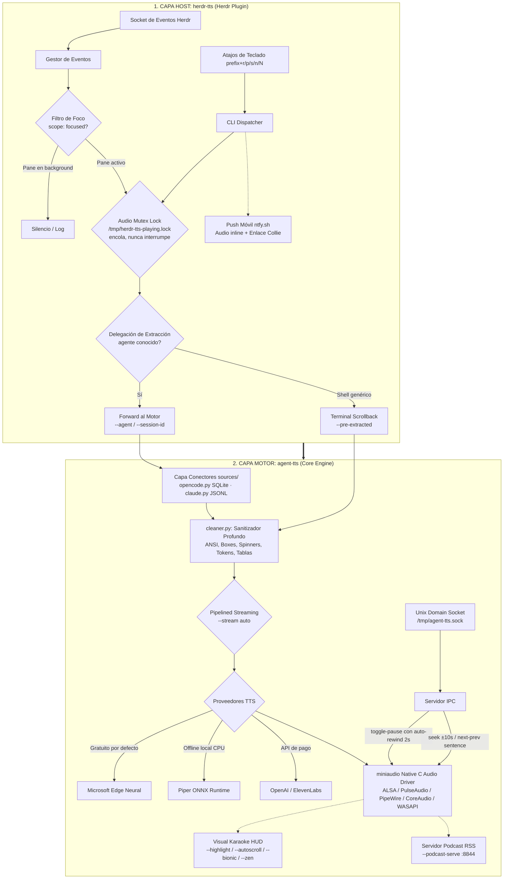

# Arquitectura del Sistema: `herdr-tts` & `agent-tts`

> **Documento de Diseño y Arquitectura de la Suite de Audio para Agentes**  
> Proyecto: [`chiptime/herdr-tts`](https://github.com/chiptime/herdr-tts) y [`chiptime/agent-tts`](https://github.com/chiptime/agent-tts)

---

## 1. Visión y Motivación

Cuando se orquestan múltiples coding agents simultáneamente en terminal (mediante [Herdr](https://herdr.dev), OpenCode, Claude Code, etc.), surgen tres problemas operativos críticos:

1. **Cacofonía acústica por colisión de voces:** Si tres agentes en paralelo completan tareas casi a la vez, los sistemas convencionales reproducen audio de forma superpuesta, generando un muro ininteligible de ruido.
2. **Interrupción y fatiga de contexto:** Si un desarrollador está redactando un prompt complejo en una ventana activa, no debe ser interrumpido por la lectura prolija de un agente que concluyó en segundo plano.
3. **El texto de terminal no es prosa hablada:** Los buffers de consola están saturados de secuencias de escape ANSI, bordes Unicode de cajas (`│`, `┌`, `└`), barras de progreso, contadores de tokens (`14.2k in | 520 out`) y bloques de código que resultan confusos al leerse textualmente.

Para resolver esto, la suite se estructura en dos capas independientes y complementarias:

---

## 2. Arquitectura en Dos Niveles (Decoupled Architecture)

### Nivel 1: `herdr-tts` (Thin Connector Host Layer)
- **Responsabilidad:** Integración con el multiplexor Herdr, gestión de concurrencia y ciclo de vida de agentes. El host **no sabe leer agentes**: detecta que algo pasó y delega.
- **Audio Mutex Lock:** Cerrojo en `/tmp/herdr-tts-playing.lock` que serializa los eventos concurrentes (encola o descarta) **sin interrumpir jamás la reproducción en curso**. Vive en el host porque aquí nace la concurrencia (múltiples panes lanzando eventos); el motor es *connection-scoped*: atiende la conexión que entra sin conocer cuántas existen ni su tipología.
- **Filtrado por Foco (`scope: focused`):** Solo vocaliza automáticamente el pane que el usuario está observando activamente.
- **Delegación de Extracción (Agent Forwarding):** Para agentes conocidos, el host solo identifica `agent_kind` + `session_id` y delega la lectura al motor (`--agent` / `--session-id`). Para shells genéricas, captura el scrollback y lo entrega ya extraído (`--pre-extracted`).
- **Notificaciones Push Móviles:** Envío del fichero de audio sintetizado a la app `ntfy.sh` en Android/iOS con reproductor en pantalla de bloqueo y deep links a la interfaz web (Collie).

### Nivel 2: `agent-tts` (Standalone Speech Engine)
- **Responsabilidad:** Motor de síntesis, audio nativo y sanitización de texto para terminales. El motor **no conoce el concepto de pane**: posee el conocimiento de fuente de cada agente.
- **Capa de Conectores de Agentes (`sources/`):** `opencode.py` (SQLite en modo solo lectura) y `claude.py` (JSONL de sesión con tail-scan inverso) resuelven la transcripción a partir de `{agent_kind, session_id}`; nuevos conectores (aider, gemini-cli, goose) se añaden aquí sin tocar el host.
- **Driver Nativo en C (`miniaudio`):** Reproduce audio directamente en memoria hacia PulseAudio/PipeWire (Linux), CoreAudio (macOS) y WASAPI (Windows) con latencia mínima, sin procesos externos (`mpv`, `paplay`).
- **Servidor IPC Interactivo:** Expone un socket Unix (`/tmp/agent-tts.sock`) para responder en caliente a comandos como `toggle-pause`, `seek +10`, `seek -10`, `next-sentence` y `prev-sentence`.
- **Auto-Rewind Cognitivo:** Al reanudar una reproducción en pausa, retrocede automáticamente 2.0 segundos para recuperar el hilo mental de la explicación.
- **Sanitizador Profundo (`cleaner.py`):** Elimina códigos ANSI, spinners, bordes de cajas y contadores de tokens; convierte tablas Markdown/ASCII en pausas conversacionales.
- **Pipelined Streaming:** Reproduce la primera frase en ~300–600ms mientras continúa sintetizando el resto del texto en un hilo de fondo.
- **Transporte de Audio a Windows (`winhost` / `wsl-ps`):** En WSL2 el motor puede enviar el PCM por TCP al host Windows (`agent-tts --winhost`, reproducción nativa vía WASAPI) con fallback automático a PowerShell en modo cero instalación; el host solo propaga la opción (`TTS_PLAYBACK`), sin cambios en su flujo por defecto.

---

## 3. Protocolo de Control IPC y Atajos

| Acción | Atajo Herdr | Comando CLI | Comando IPC (Socket) |
| :--- | :---: | :--- | :--- |
| **Play / Stop (Toggle)** | `prefix + r` | `herdr-tts --toggle-play` | N/A (Gestionado por Host) |
| **Pausa / Reanudar** | `prefix + p` | `herdr-tts --toggle-pause` | `toggle-pause` (con auto-rewind 2s) |
| **Parada Inmediata** | `prefix + s` | `herdr-tts --stop` | `stop` |
| **Rebobinar 10 segundos** | `prefix + [` | `herdr-tts --rewind` | `seek -10` |
| **Avanzar 10 segundos** | `prefix + ]` | `herdr-tts --forward` | `seek +10` |
| **Siguiente Frase** | `prefix + n` | `herdr-tts --next-sentence` | `next-sentence` |
| **Frase Anterior** | `prefix + N` | `herdr-tts --prev-sentence` | `prev-sentence` |
| **Resumen TL;DR** | `prefix + t` | `herdr-tts --tldr` | `--tldr` (heurística offline) |
| **Silenciar Auto-Speech**| `prefix + v` | `herdr-tts --toggle-auto` | N/A (Gestionado por Host) |
| **Velocidad (+10% / -10%)**| `prefix + =` / `-` | `herdr-tts --rate-up` / `down` | N/A (Persistido en config) |

---

## 4. Proveedores de Síntesis Soportados

1. **Microsoft Edge Neural (Default — 100% Free):** Voces naturales fluidas (`elvira`, `alvaro`, `en`) con latencia reducida y cero configuración de claves API.
2. **Piper ONNX (100% Offline — CPU):** Síntesis neuronal local ejecutada íntegramente en CPU mediante ONNX Runtime para entornos sin conexión o de alta privacidad.
3. **OpenAI Audio TTS:** Modelos `tts-1` y `tts-1-hd` (`nova`, `alloy`, `onyx`) para máxima fidelidad de estudio.
4. **ElevenLabs:** Voces ultra-realistas multilingües (`eleven_multilingual_v2`).

---

## 5. Hoja de Ruta y Principio Clean-Room

Todas las funcionalidades planificadas se desarrollan bajo el principio de **implementación limpia e independiente (Clean-Room)**: se extrae la necesidad funcional y operativa detectada en el flujo de trabajo multi-agente, diseñando una arquitectura nativa propia sin reutilizar ni replicar código de proyectos de terceros.

### Próximas Implementaciones Host (`herdr-tts`)
- **Snooze Granular & Mute por Pane:** Ciclos temporales de silenciado independiente (`prefix + z` para 5m/30m/2h/off y `prefix + m` para mute exclusivo de pane) con gestión atómica de estados.
- **Anti-Spam State Debouncing:** Ventana de enfriamiento (`debounce_seconds = 20`) para evitar repeticiones sonoras cuando un agente genera micro-turnos o estados de bloqueo consecutivos.
- **Dashboard TUI de Control en Herdr:** Entrypoint de pane nativo para supervisión de colas de audio, visualización de temporizadores de snooze y control interactivo de parámetros.
- **Intercomunicador Push-to-Talk (`prefix + c`):** Captura de micrófono e inferencia STT local (Whisper.cpp) en el motor; el host solo recibe el texto transcrito y lo inyecta en el pane activo.

### Próximas Implementaciones Motor (`agent-tts`)
- **Conectores Adicionales (`sources/`):** Adaptadores para aider (historial de chat markdown), gemini-cli y goose, con auto-detección del agente activo.
- **Redactor Preventivo de Credenciales (`cleaner.py`):** Detección heurística ultrarrápida de API keys, tokens JWT y contraseñas para evitar fugas sonoras o en feeds RSS/ntfy.
- **Resumen Híbrido LLM Opcional (`--llm-summary`):** Destilado de alto nivel delegando a CLIs locales (`claude`, `codex`, `ollama`) con fallback automático a las heurísticas offline `--tldr`.
- **Integración de Kokoro-82M ONNX:** Máxima calidad neural offline ejecutada en CPU (<350MB).
- **Gestor Integrado de Modelos de Voz (`agent-tts voice install`):** Descarga, verificación y configuración desatendida de modelos ONNX sin fricción manual.
