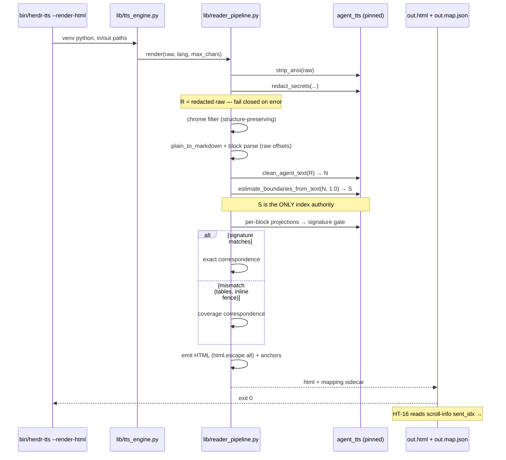

# Design: HT-15 Markdown/HTML Reader Pipeline

## Context and Goals

Deliver `lib/reader_pipeline.py`: agent output → sanitized, formatting-preserving HTML carrying sentence anchors that are **index-identical to the engine enumeration** driving `scroll-info`/`highlight` during playback. HT-16's modal receives `sent_idx` over IPC and must highlight the right element.

**Goals**: R1–R7 satisfied; stdlib + pinned `agent_tts` only; transient process; Surface Contract v1 untouched.
**Non-goals**: modal UI, engine changes, full CommonMark, ntfy/RSS notes, speech behavior changes.

## The Alignment Problem — Measured, Not Assumed

HTML is emitted over **raw** (formatting-preserved) text `R`; engine indices are computed over **normalized** text `N = clean_agent_text(R)`. `exploration.md:102` claims sharing the regex `(?<=[.!?])\s+` makes indices "guaranteed 100% identical". **That claim is false.** Measured against the pinned engine:

| Fixture | Raw sents | Oracle sents | Cause |
|---|---|---|---|
| Fence containing `x = 1. ` | 4 | **3** | fence → ` [bloque de código omitido] ` |
| `See https://ex.com/a. Next…` | 2 | **1** | `https?://\S+` swallows the `.` |
| `…tablas, etc. Y luego…` | 2 | **1** | `\betc\.` → `etcétera` deletes the `.` |
| `Open the PR now.` | 2 | 2 | count equal, **text differs** (`pull request`) |
| `Head:` + table + `Tail.` | 3 paras | **1 para, 1 sent** | pipe rule `\s*[│|]\s*` matches across `\n`, annihilating paragraph structure |
| `` (empty) | 1 | 1 | oracle emits one empty sentence |

Any raw-side enumeration drifts in both directions. Indices must come **from the engine**.

## Decision: Hybrid (b)+(c) — Engine-Authoritative Anchors with Block Correspondence

| Option | Verdict |
|---|---|
| (a) Build HTML from normalized text | **Rejected** — `[bloque de código omitido]`/`enlace web` reach output; violates R1 |
| (b) pure dual-track offset inversion | **Rejected as stated** — requires mirroring 11 cleaner stages + lexicon in the host; forks engine truth, the exact risk R5 guards |
| (b′) global token diff `R`↔`N` | **Rejected** — spiked; `difflib` silently lost sentence 0 on the secret fixture. Fuzzy alignment fails silently |
| **(b)+(c) chosen** | Indices taken **verbatim from the oracle**; blocks are *assigned* to them; sidecar map for HT-16 |

**Mechanism.** Index truth is never recomputed — the pipeline calls the engine and reuses its `Sentence.index`/`paragraph_index`. Only *anchor granularity* is derived, so drift is structurally impossible; the worst failure is a coarser highlight, never a wrong index.

Block→sentence correspondence runs in two modes, chosen by a **self-verifying gate**: project each raw block through `clean_agent_text`, concatenate, and compare the oracle signature `[(index, paragraph_index, text)]` against the global oracle.

- **`exact`** (gate passes, 8/10 spiked fixtures): 1:1 block↔sentence correspondence; sub-block ranges resolved by local match.
- **`coverage`** (gate fails — tables, inline fences): deterministic monotone two-pointer over word tokens assigns each oracle sentence the span of blocks it consumes. Indices still exact; anchors may cover whole blocks.

A sentence may span multiple blocks (table fixture). Exactly one element per `sent_idx` is the **primary** anchor (`class="tts-sent"` + `id`); further fragments carry `class="tts-sent-cont"` + `data-sent-idx` only — preserving `count(.tts-sent) == len(mapping) == oracle count` (R5 "mapping mirrors spans").

### Alignment validity contract

`clean_agent_text` is parameterized by `lang`, `max_chars`, `summarize` and the **user lexicon** (`AGENT_TTS_LEXICON` → `~/.config/agent-tts/lexicon.json`). Measured: `max_chars=20` cut 4 sentences to 2; `lang` flips `etcétera`/`etcetera`. Anchors are valid **only** against a speech invocation with the same tuple. `render()` takes `lang`/`max_chars` explicitly; `summarize`/`--tldr` is unsupported for anchoring (the summarizer rewrites text). The mapping records the tuple plus a lexicon fingerprint so consumers detect staleness.

## Sequence



## Module Layout

`lib/reader_pipeline.py` (new, stdlib + `agent_tts`):

```python
@dataclass(frozen=True)
class SentenceAnchor:
    sent_idx: int; para_idx: int
    text: str                      # raw REDACTED span text (mirrors primary span)
    block_ids: tuple[str, ...]
    fragments: tuple[tuple[int, int], ...]   # char ranges in R
    exact: bool

@dataclass(frozen=True)
class RenderResult:
    html: str; anchors: tuple[SentenceAnchor, ...]
    alignment: str                 # "exact" | "coverage"
    normalized: str; engine: dict

def sanitize(raw: str) -> str
def plain_to_markdown(text: str) -> str
def markdown_to_html(md: str, anchors=None) -> str
def build_anchors(redacted: str, *, lang="es", max_chars=0) -> tuple[SentenceAnchor, ...]
def render(raw: str, *, lang="es", max_chars=0, pre_extracted=False) -> RenderResult
def mapping_json(result: RenderResult) -> str
def render_to_files(raw, html_path, map_path=None, **kw) -> int
```

**Integration.** `lib/tts_engine.py`: add `reader_pipeline` re-export + a `--render-html` branch *before* `main()`, leaving existing imports and IPC delegation untouched. `bin/herdr-tts`: new `--render-html)` case beside `--render-text)` (line ~6613), delegating to `"$VENV_PYTHON" "$ENGINE_SCRIPT"`; usage error mirrors `render_text_audio` (`tt usage.render_html` → stderr, `return 1`). New keys in **both** `TT_EN`/`TT_ES`: `usage.render_html`, `help.render_html`, `error.render_html.input`, `error.render_html.engine`.

## Data Contracts

**Anchor markup** — attributes always `html.escape`d; `<pre>`/`<table>` carry attributes directly (a `<span>` cannot legally wrap flow content):

```html
<span class="tts-sent" data-sent-idx="0" data-para-idx="0" id="tts-sent-0">Intro text here.</span>
<pre class="tts-sent" data-sent-idx="1" data-para-idx="1" id="tts-sent-1"><code class="language-python">x = 1. </code></pre>
<span class="tts-sent-cont" data-sent-idx="0">continuation fragment</span>
```

**Sidecar** `out.map.json` (contract for HT-16):

```json
{ "version": 1, "contract": "reader-pipeline/anchors@1",
  "alignment": "exact", "total_sents": 3, "total_paras": 3,
  "engine": { "lang": "es", "max_chars": 0, "summarize": false, "lexicon_fp": "sha256:…" },
  "sentences": [ { "sent_idx": 0, "para_idx": 0, "text": "Intro text here.",
                   "selector": "#tts-sent-0", "block_ids": ["b0"],
                   "fragments": [[0, 16]], "exact": true } ] }
```

**Exit codes**: `0` success (including `coverage`, empty input, malformed markdown); `1` usage; `2` input unreadable **or redaction failure** (fail closed — no file written); `3` `agent_tts` unavailable.

## Parity Fixture Strategy

Oracle = the pinned `agent_tts` in the hermetic venv: `estimate_boundaries_from_text(clean_agent_text(R, pre_extracted=True), 1.0)`, invoked independently of the pipeline. **Hermeticity is mandatory**: `AGENT_TTS_LEXICON` must point at a fixture file and `HOME`/XDG must be stubbed, otherwise a real `~/.config/agent-tts/lexicon.json` silently changes normalization. Asserts per fixture: anchor count == oracle count; `data-sent-idx` sequence == `0..n-1` in document order; `data-para-idx` sequence == oracle `paragraph_index` sequence; mapping entry count == `count(.tts-sent)`.

| # | Fixture | Proves |
|---|---|---|
| F1 | 3-sentence paragraph | baseline order + constant `para_idx` |
| F2 | fence containing `. ` | 4→3 drift absorbed |
| F3 | inline short fence (`comando:`) | boundary *inside* code → `coverage` |
| F4 | URL swallowing `.` | 2→1 drift |
| F5 | `etc.` abbreviation | 2→1 drift |
| F6 | `PR` → `pull request` | mapping text is **raw**, index from oracle |
| F7 | heading + table + tail | 1 sentence across 3 blocks; cont-spans |
| F8 | empty input | exactly 1 anchor, empty text, exit 0 |
| F9 | unclosed fence | exit 0, escaped, zero raw tags |

## Failure Modes

| Mode | Behavior |
|---|---|
| Malformed markdown / unclosed fence | escaped-text fallback, exit 0; anchors unaffected (engine-sourced) |
| `redact_secrets` raises | **fail closed**: no file written, exit 2. Never emit unredacted text |
| `agent_tts` import fails | exit 3 + `TT` message; no partial HTML |
| Signature gate fails | `alignment:"coverage"`, exit 0, recorded in sidecar |
| Oversized input | block projections capped (2000 blocks); beyond → `coverage` |

## Threat Matrix

`--render-html` adds argv routing, file I/O, and a venv subprocess, so the matrix is evaluated; all five rows are **N/A**.

| Boundary | Applicability | Reason |
|---|---|---|
| Documentation-like paths | N/A | Input is read as text and never executed or classified as executable; output is a written `.html` artifact |
| Git repository selection | N/A | No VCS invocation |
| Commit state | N/A | No index/worktree interaction |
| Push state | N/A | No remote operation |
| PR commands | N/A | No PR automation |

The real boundaries here — argv handling and escaping — are covered by R4 (XSS/scheme) and R6 (contract) scenarios, not by manufactured matrix tasks.

## Test Strategy (RED-first)

| Smoke | Requirement | Order |
|---|---|---|
| 40a | R1 sanitization preserves structure | 1 |
| 40b | R2 redaction before transform (incl. in-fence) | 2 |
| 40c | R3 deterministic heuristics + safe degradation | 3 |
| 40d | R4 escaping, scheme allowlist | 4 |
| 40e | R5 oracle parity F1–F9 | 5 |
| 40f | R6 `--render-html`, `TT_EN`/`TT_ES`, contract `1` | 6 |
| 40g | R7 no new deps, transient process | 7 |

Per `strict_tdd: true`, each sub-scenario is added to `scripts/smoke-tests.sh` and observed **failing** before implementation. 40b and 40e precede emission work: redaction and index truth are the two properties that cannot be retrofitted.

## Performance

On-demand only; the daemon stays a bash loop (0 KB resident added). Per invocation: one `clean_agent_text`, one oracle run, plus one projection per block over ≤300 scrollback lines. Spiked fixtures returned instantly; budget <100 ms typical, dominated by interpreter startup — the same cost already paid by `--render-text`.

## Traceability

| Req | Design section | Smoke |
|---|---|---|
| R1 | Sequence (strip_ansi→redact→chrome), Module Layout | 40a |
| R2 | Sequence, Failure Modes (fail closed), Data Contracts | 40b |
| R3 | Module Layout (`plain_to_markdown`), Failure Modes | 40c |
| R4 | Data Contracts (escaping, `<pre>`/`<span>` rules) | 40d |
| R5 | Alignment Problem, Decision, Parity Fixtures | 40e |
| R6 | Module Layout (integration), Exit codes | 40f |
| R7 | Module Layout (stdlib), Performance | 40g |

No requirement is unmet.

## Rollback

Revert HT-15 slices only: delete `lib/reader_pipeline.py`, the `--render-html` case, the new `TT_*` keys, the `tts_engine.py` branch, and scenario 40. Engine pin, `bootstrap.sh`, contract version `1`, `--render-text`/`--speak`, and all IPC paths are untouched by construction. No migration.

## Open Questions

- [ ] R5's "N spans / entry i" is preserved via primary + `tts-sent-cont` fragments. Confirm HT-16 accepts multi-fragment highlight for tables/inline fences.
- [ ] Should `--render-html` emit the sidecar always, or only with an explicit `--map <path>`? Design assumes optional third argument, default off.
- [ ] Review budget: proposal forecasts ~800 lines vs a 400-line policy. `ask-on-risk` decision belongs to `sdd-tasks`, not here.
